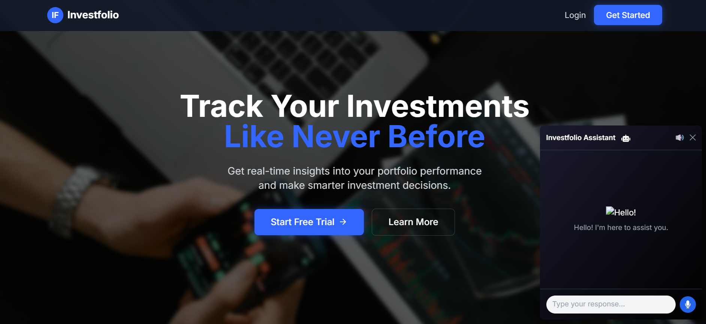

# Investment Portfolio Tracker 📈 💹

A full-stack investment portfolio tracking application built with the MERN stack (MongoDB, Express.js, React, Node.js). This application helps investors manage and track their investment portfolios across multiple asset classes including stocks, commodities, forex, bonds, ETFs, and cryptocurrencies.

🌐 **Live Demo:** https://investfolio.vercel.app

## Overview 🌟

The Investment Portfolio Tracker provides a comprehensive solution for investors to:
- Track multiple investment portfolios in real-time
- Monitor performance across different asset classes
- Visualize portfolio allocation and returns
- Receive email notifications for important updates
- Manage user authentication securely

## Project Structure 🏗️

```
📦 Investment-Portfolio-Tracker
├── 🎯 frontend
│       ├── 📱 src
│       │   ├── components
│       │   ├── pages
│       │   ├── services
│       │   ├── assets
│       │   ├── App.jsx
│       │   └── main.jsx
│       ├── 🎨 public
│       └── 📝 package.json
│
└── ⚙️ backend
    ├── 🔧 config
    │   └── db.js
    ├── 🎮 controllers
    │   └── userControllers.js
    ├── 🔒 middlewares
    │   └── authUsers.js
    ├── 📊 models
    │   ├── asset.model.js
    │   └── userModels.js
    ├── 🛣️ routes
    │   └── userRoutes.js
    ├── 🛠️ utils
    │   └── sendmail.js
    ├── 📝 package.json
    └── 🚀 app.js
```

## Tech Stack 🛠️

### Frontend 🎯
- React.js with Vite
- Chart.js for data visualization
- TailwindCSS for styling
- React Router for navigation
- React Icons
- Framer Motion for animations

### Backend ⚙️
- Node.js & Express.js
- MongoDB with Mongoose
- JWT for authentication
- Bcrypt for password hashing
- Nodemailer for email functionality

## Getting Started 🚀

### Prerequisites
- Node.js (v14 or higher)
- MongoDB installed and running
- npm or yarn package manager

### Installation 📥

1. Clone the repository
```bash
git clone https://github.com/ayeshashaw/Investfolio-Investment-Portfolio-Tracker.git
cd Investfolio-Investment-Portfolio-Tracker
```

2. Set up environment variables
```bash
# In backend directory, create .env file
PORT=3777
MONGODB_URI=your_mongodb_connection_string
JWT_SECRET=your_jwt_secret
```

3. Install Backend Dependencies
```bash
cd backend
npm install
```

4. Install Frontend Dependencies
```bash
cd ../frontend
npm install
```

5. Configure Frontend Environment
```bash
# In frontend directory, create .env file
VITE_APP_API_URL=http://localhost:3777/api
```

### Running the Application 🏃‍♂️

1. Start the Backend Server
```bash
cd backend
npm run dev
# Server will start on http://localhost:3777
```

2. Start the Frontend Development Server
```bash
cd frontend
npm run dev
# Frontend will be available on http://localhost:5173
```

### API Endpoints 🛣️

#### Authentication
- POST `/api/user/signup` - Register new user
- POST `/api/user/login` - User login
- GET `/api/user/is-auth` - Check authentication status

#### Portfolio Management
- GET `/api/user/get-user` - Get user profile data
- POST `/api/user/addasset` - Add new asset to portfolio
- GET `/api/user/getassets` - Get all user assets
- DELETE `/api/user/deleteasset/:assetId` - Delete an asset

### Development Best Practices 👨‍💻

1. Code Style
- Follow ESLint configuration
- Use meaningful variable and function names
- Write comments for complex logic
- Follow component-based architecture

2. Git Workflow
- Create feature branches for new features
- Write meaningful commit messages
- Review code before merging
- Keep commits atomic and focused

3. Testing
- Write unit tests for components
- Test API endpoints
- Perform integration testing
- Conduct user acceptance testing

### Deployment 🚀

1. Backend Deployment
- Set up production environment variables
- Configure MongoDB Atlas connection
- Set up proper CORS settings
- Configure email service

2. Frontend Deployment
- Build production assets
- Configure environment variables
- Set up CDN for static assets
- Configure routing

### Troubleshooting 🔧

Common Issues:
1. Connection Issues
- Check MongoDB connection string
- Verify API endpoint URLs
- Check CORS configuration

2. Authentication Problems
- Verify JWT token
- Check authorization headers
- Validate user credentials

3. Asset Management Issues
- Verify asset data format
- Check API response structure
- Validate user permissions

## Features 💫

### Interface Screenshots 📸

#### Home Page

The landing page with key features and call-to-action.

#### Dashboard

The dashboard provides an overview of portfolio performance and asset allocation.

#### Assets Management

Users can view and manage all their investment assets in one place.

#### Portfolio Comparison

Compare performance across different portfolios and time periods.


#### Team

Information about the development team behind the application.


### User Authentication and Authorization 🔐
- Secure user registration and login system
- JWT-based authentication
- Password hashing using bcrypt
- Protected routes and API endpoints
- Email verification system

### Investment Portfolio Management 📊
- Create and manage multiple investment portfolios
- Add, update, and delete investment assets
- Track investment performance over time
- Calculate portfolio returns and profits/losses
- Support for multiple asset classes:
  - Stocks
  - Commodities
  - Forex
  - Bonds
  - ETFs
  - Cryptocurrencies

### Asset Tracking 📱
- Real-time asset price updates
- Historical price data visualization
- Asset performance metrics
- Custom asset notes and tags
- Asset allocation analysis

### Data Visualization 📈
- Interactive charts using Chart.js
- Portfolio composition breakdown
- Performance trends over time
- Asset allocation pie charts
- Gain/loss visualization


### Responsive Design 🎨
- Mobile-first approach
- Smooth animations with Framer Motion
- Intuitive user interface
- Cross-browser compatibility
- Tailwind CSS for modern styling

## Contributing 🤝
Contributions are welcome! Please feel free to submit a Pull Request.

